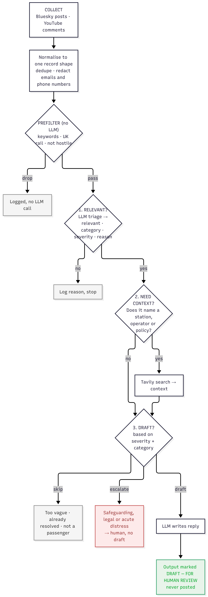
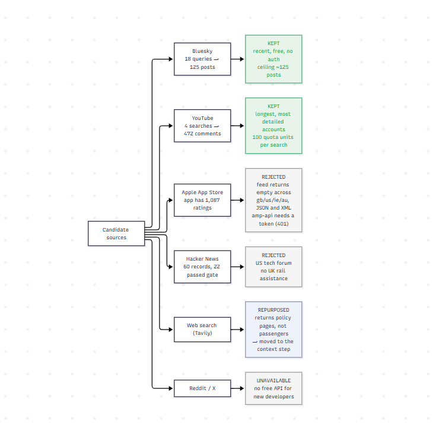

# Passenger Assistance Agent

Finds public posts where people describe their experience of passenger assistance
on UK rail, works out which ones a human should reply to, and drafts the reply.
Nothing is ever posted. Every draft goes to a review queue for a person to read.

A case study for the Transreport AI Intern role.



## What it does

It collects Bluesky posts (18 search queries) and YouTube comments (4 searches
across about 30 videos), then puts everything into one record shape so the agent
never has to know where a comment came from. Duplicates are dropped by a stable
hash of source plus id, and emails and phone numbers are stripped on ingest.

Then a prefilter with no LLM in it: long enough to judge, assistance keyword, UK
rail context, not a US transit account, not hostile. Anything that fails is
logged and costs nothing.

What survives goes through three decisions:

1. Relevant? One LLM call returns relevant, category, severity and a one-sentence
   reason.
2. Needs context? If the post names an operator, a station or a policy, one
   Tavily search.
3. Skip, escalate, or draft? A rule on severity and category, then the escalation
   keyword check.

Drafts and escalations are written to `output/review_queue_*.md` for a human and
`output/run_*.json` for the record.

A run from this afternoon: 625 records fetched, 130 passed the prefilter, 10
assessed, 8 drafts, 1 escalated, 1 rejected as not relevant. The fetch count
moves between runs because the sources themselves move: YouTube returned 420,
472 and 500 comments on three runs an hour apart.

## Why UK rail

It is Transreport's own domain, and it is the scope where a failure is specific
enough to judge. "Nobody met me at the platform" is either true of a journey or
it isn't. If I had covered airports and ferries and the whole sector, the
relevance decision would have been vaguer and I could not have checked it in four
hours. The brief asked for a small number of sources handled well, and I think
the same logic applies to scope.

## Picking the sources



I tested five and ruled out two more on access. Two are in the final run.

### Bluesky, kept

Free, no auth, and people post about assistance while it is happening. Logged-out
search gives one page per query and passing a cursor 403s, so the only lever I
have is more queries. Going from 8 queries to 18 moved the total from 113 to 125
records. That ceiling is the platform's, not the code's: the UK rail assistance
conversation on Bluesky is small, maybe a hundred posts. Good for recency,
limited in volume.

One thing that cost me time: public search only works on `api.bsky.app`.
`public.api.bsky.app` answers `searchPosts` with a CDN 403.

### YouTube, kept

4 searches across about 30 videos return around 500 comments, and roughly 20% of
them survive the prefilter. The accounts here are much longer than anything on
Bluesky, because people describe a whole journey instead of a 280-character
reaction. The best material in the project came from here: a power wheelchair
coming off a ramp because staff didn't check, a passenger left on a train 20
minutes after arrival, arriving at Waterloo to find no ramp waiting, a visually
impaired passenger on what station wayfinding actually does for them.

Each search costs 100 quota units against a 10,000/day cap and each
commentThreads call costs 1, so one fetch is about 450 units. I count the
searches rather than loop them.

### Apple App Store, tested, doesn't work

This is the source I wanted most, because it is first-party feedback on
Transreport's own app. The app (ID 1542190496) has 1,087 ratings on the GB store,
so reviews exist. Apple's public RSS customer-reviews feed returns a well-formed
but empty response for this app on gb, us, ie and au, in both JSON and XML: HTTP
200, a valid Atom envelope, zero entries. The endpoint Apple's own web store uses
(`amp-api.apps.apple.com`) returns 401 without a bearer token. It is a
long-reported undocumented behaviour that hits some app IDs and not others, with
no official explanation. I gave it ten minutes and moved on.

I can't tell from outside whether Apple is withholding the reviews or whether
there are 1,087 star ratings with very little written review text, since the feed
only returns records that have review text attached. Transreport can check that
in App Store Connect. The adapter is still in `sources.py` and works, so if the
feed starts returning entries it needs no new code.

### Hacker News, tested, rejected

60 records fetched, 22 passed the keyword gate, none were about UK rail
assistance. It is a US technology forum, and the matches were ADA policy debate,
Dutch transit and OpenStreetMap.

### Tavily as a way in, tested, rejected, reused elsewhere

Searching the web for passenger complaints returns National Rail, Network Rail
and operator accessibility policy pages, 5 of the first 6 results. Tavily is
built to find authoritative pages, so it is wrong for finding passengers and
right for the context step. It stayed in the pipeline, just not as a source.

### Reddit and X, not available

Neither has a free API for a new developer. Reddit would be the best thing to add
if there were budget: r/disability and r/uktrains carry the same long accounts
YouTube gave me, with better geographic targeting.

## What this does that a prompt wrapper doesn't

Three separate decisions, each logged with its reason. Relevance, context and
drafting are different judgements with different failure modes, and the output
shows which one fired. If a draft comes out wrong I can see whether triage
misclassified it, whether context was missing, or whether the draft rules failed.

Cheap work before expensive work. 495 of the 625 records died at a keyword gate
that costs nothing, which left 130 eligible for an LLM call. Sending everything
to the model would have worked and would have cost roughly 4.8x more for the same
answers.

Rules for the deterministic parts, a model for the rest. The escalate decision is
a keyword rule on legal and safety language plus a severity check, so it is
auditable and does not drift between runs. Relevance is an LLM call, because no
keyword list separates a passenger's account from a train driver's advice. I
tuned both by watching real output rather than guessing up front.

Guardrails that encode who the client is. The draft rules forbid promising
compensation, promising to tell a manager, asking for personal details in public,
and agreeing that the service is broken. They also forbid saying "our staff"
about station staff, because Transreport runs the assistance service and not the
trains.

Hostility aimed at disabled passengers is dropped at the prefilter and never
reaches the drafting path.

The survivors are interleaved by source before the limit is applied. YouTube
loses about 80% of its records at the gate and Bluesky far less, so taking the
first N in fetch order was almost all Bluesky and the second source never
appeared in a short run.

It is observable. Every step is a Langfuse span. Across this afternoon's runs,
30 `process` traces contain 30 `triage`, 21 `needs_context`, 16 `write_draft` and
10 `gather_context` calls, so I can see the funnel per decision. Langfuse v4
batches spans over OpenTelemetry and drops them silently if the process exits
first, so `run.py` flushes at the end.

## What surprised me

The source I expected to be best was dead and the one I expected to be worst was
the best. App Store reviews should have been the strongest signal, since it is
Transreport's own app, and the feed returns nothing. I assumed YouTube comments
would be video chatter, and they turned out to be the most detailed passenger
accounts in the project.

Two bugs taught me where each kind of logic fails.

A thank-you note from a parent whose son travelled to a hospital appointment got
escalated as a safeguarding case, because "hospital" was in my escalation keyword
list. The word was about the destination, not an injury. I scoped the keyword
check to non-praise posts and took bare "hospital" and "police" out of the list.

Then the opposite. A real complaint, "Passenger assist at Euston is awful", was
silently skipped, because triage filed it as category `other` and my rule skipped
everything categorised `other`. Reading category and severity together fixed it.

Keyword matching and relevance are not the same thing, and the gap is wide. Six
of ten YouTube comments in one run passed every keyword check and were correctly
rejected by triage: a train driver giving advice, a Swedish train feature, an
Australian system, a question about tilting trains, and some train-layout
enthusiasm. Only a model could tell those apart from a passenger's account. That
is the argument for having a triage step at all.

Drafts can be fluent and still wrong. The guardrails caught the obvious promises
about compensation, refunds and investigations, and missed the soft ones. An
early draft said "I'll make sure their managers know", which the agent has no
authority to promise. Another said "our teams at Exeter and Paddington", claiming
staff who work for the operator. Another invented an incident the person never
described. All three only showed up when I read the output.

Triage is not stable on borderline cases. In two separate runs, two posts
carrying the same quoted text came back with opposite relevance verdicts. Same
words, different surrounding context, different answer. That is the clearest case
I have for measuring triage against hand-labelled data before trusting any of
these numbers.

## What I'd do next

I stopped at four hours. In priority order:

1. Measure it. There is no ground truth and no precision or recall number yet.
   I'd hand-label 100 records, run them through, and find out how often triage is
   wrong and in which direction. Everything below this is guesswork until that
   exists.
2. A reflection pass on drafts. A second LLM call that checks each draft against
   the rules and rewrites once. I designed it and then cut it, because it wasn't
   on the diagram and I'd rather the code and the diagram match. It would
   probably have caught every draft problem above.
3. Abuse and hostility routing. Hostile content is dropped right now. A comment
   attacking disabled passengers is a moderation and duty-of-care matter, so it
   should go somewhere, just never to a draft.
4. Deduplicate across runs. Record IDs are stable but each run starts fresh. A
   small store of already-seen IDs would stop the same post being drafted twice.
5. Reddit, if there is budget. Best remaining source for long UK accounts.
6. Bluesky pagination, with `until=` stepping backwards past the single-page
   limit. Low value, since breadth of phrasing finds more people than depth of
   history.
7. Severity-based routing. High severity all goes to one queue at the moment. In
   reality a safeguarding case and a legal threat go to different people.
8. A proper reviewer interface. The markdown queue works, but it assumes someone
   opens a file. Approve, edit and reject with the decision captured would also
   generate the labelled data item 1 needs.

## How I used AI coding tools

I used Claude throughout, as a pair rather than a code generator. Specifically:

- Scoping. I talked through which context to pick and why, and had the
  time-boxed plan challenged before I started rather than halfway through.
- Scaffolding. First drafts of the source adapters, the agent's decision
  functions and the CLI. I reviewed and changed all of it. The record shape, the
  decision thresholds, the prompt rules and the escalation list are my decisions
  and I can defend them.
- Debugging. The Gemini 503 and 429 handling, a git repository I accidentally
  initialised over my home directory, truncated keys in `.env`, and a rebase
  conflict.
- Reading my own output critically. Several of the draft-quality problems above
  came up when I shared the actual output rather than reasoning about the prompt
  in the abstract.
- What I didn't hand over. The scope decision, the diagrams, the source
  rejections, and the judgement about what was worth building in four hours.

## Running it

```bash
python -m venv .venv
.venv\Scripts\Activate.ps1          # Windows PowerShell
pip install -r requirements.txt
cp .env.example .env                 # then fill in your keys
python check_setup.py                # verifies every source
python run.py
```

Flags: `--sources bluesky youtube web hackernews appstore all`, `--limit N`,
`--dry-run` (fetch and prefilter only, no LLM calls), `--out DIR`. The default is
`--sources bluesky youtube --limit 10`.

There is a `time.sleep(4)` between records, because free-tier Gemini allows about
15 requests a minute and each record makes two or three calls.

### The files

`sources.py` has one fetch function per source, all returning the same record
shape, plus the redaction and dedupe helpers.

`agent.py` has the prefilter, the three decisions, the prompts and the rules.

`run.py` is the CLI. It writes the review queue and the run summary.

`check_setup.py` was the first thing I wrote. It is not part of the agent. It
tests every source and key and prints a status table, so I knew what I actually
had access to before designing anything around it.

`diagram.md` and `diagram.png` are the decision flow.
`source_selection_diagram.md` and `source_selection_diagram.png` are the source
comparison.

### Keys

All keys live in `.env`, which is gitignored. `.env.example` lists what is
needed. Gemini model names are aliases (`gemini-flash-lite-latest`) rather than
pinned versions, because the pinned names 404 for a newly created key.

## Handling people's data

These are real posts by real people, and several of them describe distressing
journeys.

- Only what is needed is stored: id, source, author handle, text, timestamp,
  public URL. No avatars, no follower counts, no profile data.
- Emails and phone numbers are stripped at ingest, before anything is stored or
  sent to a model.
- `output/` is gitignored. The review queue never goes into the repository.
- Nothing is posted, ever. There is no posting code in this project.
- Every draft is labelled for human review, and high-severity cases get no draft
  at all, so they go to a person.