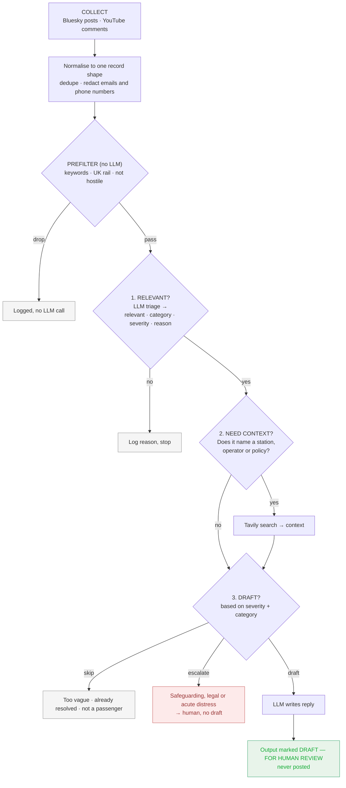

@'
# Decision flow

```mermaid
flowchart TD
    A["COLLECT<br/>Bluesky posts · YouTube comments"]
    B["Normalise to one record shape<br/>dedupe · redact emails and phone numbers"]
    A --> B --> P

    P{"PREFILTER (no LLM)<br/>keywords · UK rail · not hostile"}
    P -->|drop| P1["Logged, no LLM call"]
    P -->|pass| C

    C{"1. RELEVANT?<br/>LLM triage →<br/>relevant · category · severity · reason"}
    C -->|no| C1["Log reason, stop"]
    C -->|yes| D

    D{"2. NEED CONTEXT?<br/>Does it name a station,<br/>operator or policy?"}
    D -->|no| E
    D -->|yes| D1["Tavily search → context"]
    D1 --> E

    E{"3. DRAFT?<br/>based on severity + category"}
    E -->|skip| E1["Too vague · already resolved · not a passenger"]
    E -->|escalate| E2["Safeguarding, legal or acute distress<br/>→ human, no draft"]
    E -->|draft| F["LLM writes reply"]

    F --> G["Output marked DRAFT — FOR HUMAN REVIEW<br/>never posted"]

    classDef stop fill:#f5f5f5,stroke:#999,color:#333
    classDef halt fill:#fdeaea,stroke:#c66,color:#933
    classDef out fill:#e8f4ea,stroke:#4a7,color:#1a3
    class C1,E1,P1 stop
    class E2 halt
    class G out
```
'@ | Set-Content -Encoding utf8 diagram.md