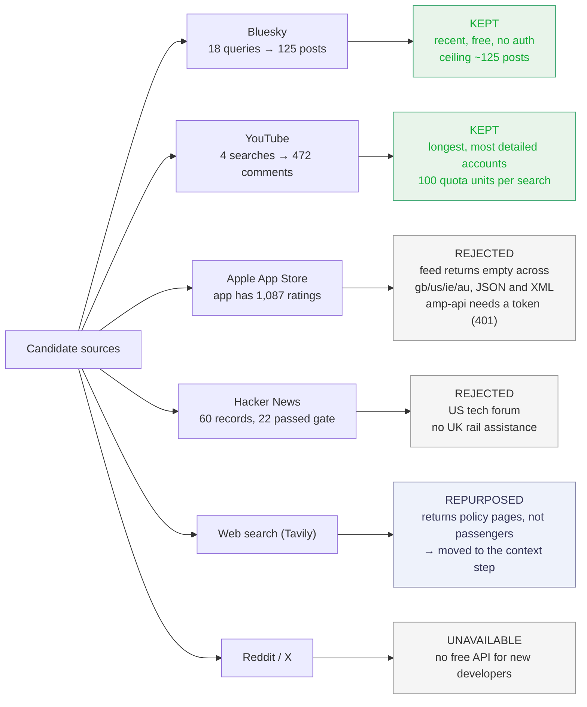

@'

---

# Source selection

Six sources were evaluated before the flow above was built. Two were kept.

```mermaid
flowchart LR
    S["Candidate sources"] --> B & Y & A & H & W & R

    B["Bluesky<br/>18 queries → 125 posts"] --> BK["KEPT<br/>recent, free, no auth<br/>ceiling ~125 posts"]
    Y["YouTube<br/>4 searches → 472 comments"] --> YK["KEPT<br/>longest, most detailed accounts<br/>100 quota units per search"]
    A["Apple App Store<br/>app has 1,087 ratings"] --> AR["REJECTED<br/>feed returns empty across<br/>gb/us/ie/au, JSON and XML<br/>amp-api needs a token (401)"]
    H["Hacker News<br/>60 records, 22 passed gate"] --> HR["REJECTED<br/>US tech forum<br/>no UK rail assistance"]
    W["Web search (Tavily)"] --> WR["REPURPOSED<br/>returns policy pages, not passengers<br/>→ moved to the context step"]
    R["Reddit / X"] --> RR["UNAVAILABLE<br/>no free API for new developers"]

    classDef keep fill:#e8f4ea,stroke:#4a7,color:#1a3
    classDef drop fill:#f5f5f5,stroke:#999,color:#333
    classDef move fill:#eef2fb,stroke:#88a,color:#335
    class BK,YK keep
    class AR,HR,RR drop
    class WR move
```
'@ | Add-Content -Encoding utf8 diagram.md